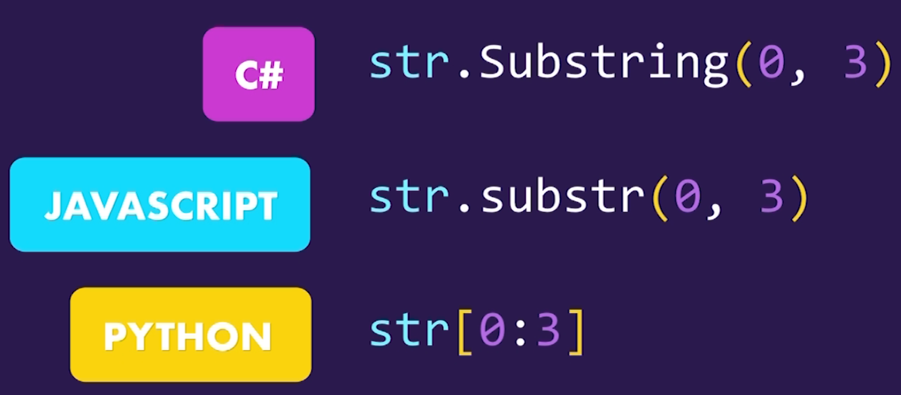
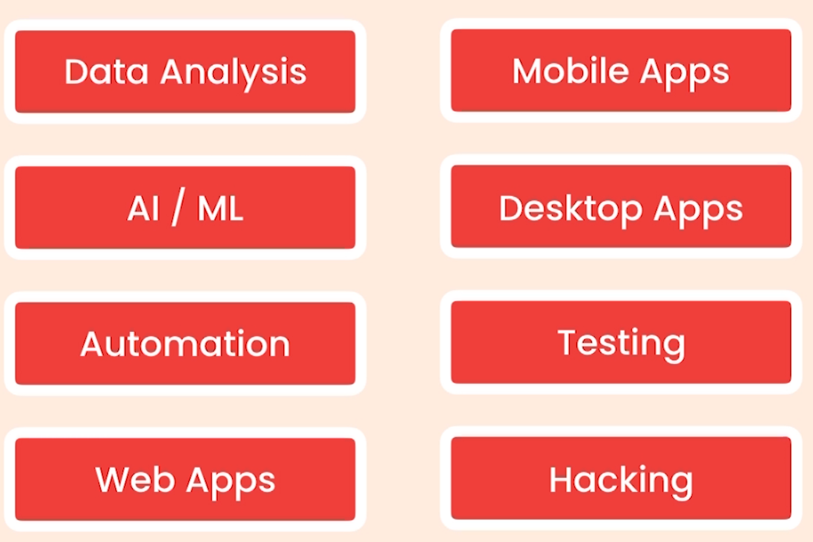
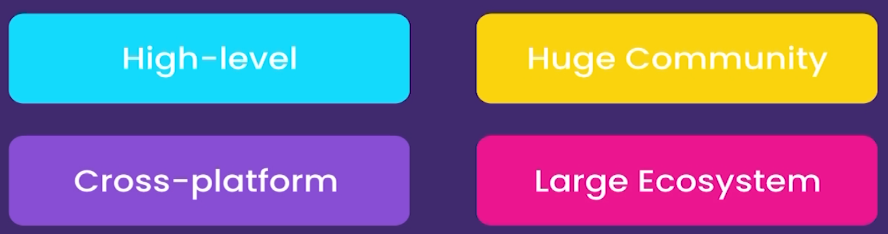
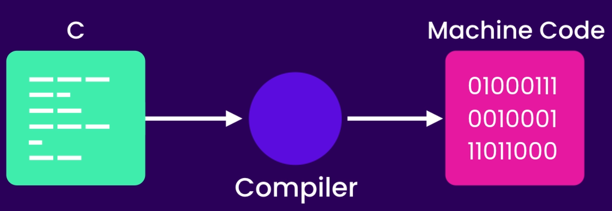
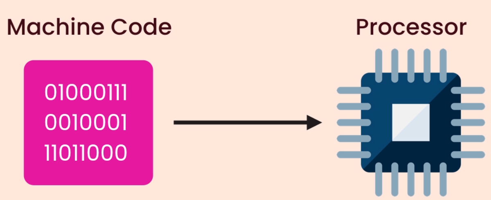
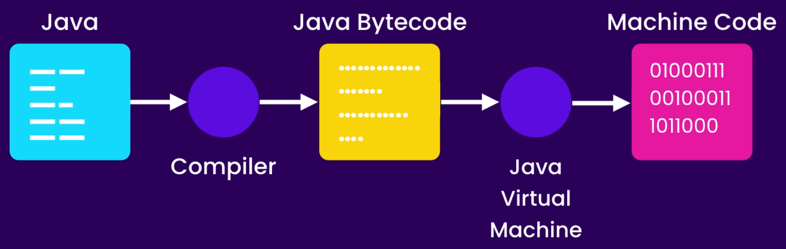
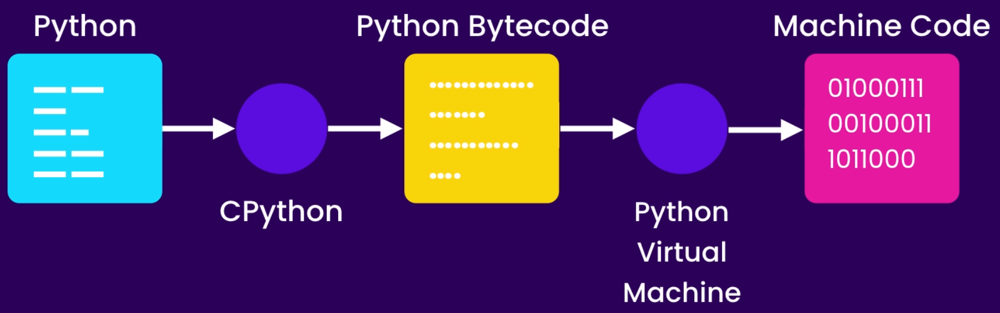
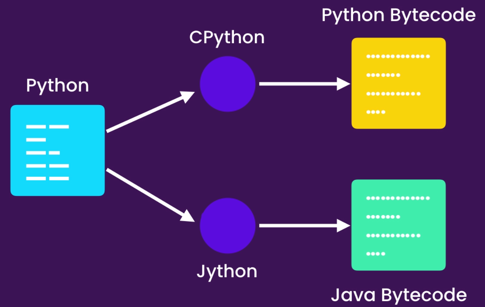

# Python-course for beginners

### Getting started

- About Python

  - The World's Fastest growing programming language
  - Most Popular among Software Engi., Data Analysts, Math, Science, Net Engi., and Kids
  - Google, Facebook, Spotify, DropBox, and etc. use Python
  - Python is simple
  - 
  -
  - Python is a multipurpose Language
  -
  - 
  -
  - Most Desirable language
  - 
  -
  - Python2 and Python3
  -

- Installation Instruction

  - Install python (Download and install)
  - Note "check `Add python 3 to PATH`"
  - check your installation on windows Command prompt

- Python Interpreter

  - Check some code in it
  - Check errors

- Editors

  - Text Editors `Notepad` , `Atom`, `Sublime`
  - IDEs `Pycharm`,
  - Use `VSCode` for this class

- Create Your First Python File

  - Open your folder in VSCode And create .py file
  - Talk about extensions
  - First Built-in Function `Print()`
  - Execute first code in terminal

- Turn VSCode to a Powerful IDE Using Extensions

  - Install python Extension in VSCode
  - 
  - Install Linter to find Potential errors
  - Select right Python for your Project

- PyLint

  - Check PyLint Functionality
  - Check errors in problems panel
  - Talk about command pallet `Shift + ctrl + p`
  - Choose Right linter - `pylint`

- Python Enhancement Proposal

  - PEPs In google
  - PEP8
  - Talk about Python code formats
  - Format Document In command pallet
  - autopep8 Installation
  - Talk about some developer mistake in formatting code
  - Turn auto format on save in `Code>Preferences>sittings`
  - Search for FormatOnSave and turn it on

- Running Python Code

  - Install Code Runner
  - Running Code by Key or `ctrl+alt+n`

- Python Implementation

  - Cpython and python interpreter
  - Other Implementations of python Jython, IronPython, PyPy
  - These implementations help us to use other languages code in our python code

- Execution of Python code

  - Cpython and python interpreter
  -
  - C Translation to machine code
  - - 
  - Codes are different in Mac and Windows based on compliers
  -
  - - 
  -
  - Java Solve the problem
  -
  - - 
  -
  - Python use it
  - - 
  -
  - Jython Workflow
  -
  - - 

### Primitive Types

- Variables

  - Core concept of storing data by programming languages
  - Three different built-in primitive types in python
  - Numbers (100, 4.9,...), Booleans (True/False), Strings ("Your Name")
  - All your variables' name should be descriptive and meaningful
  - All letters in your variable's name should be in lower case
  - Set a space before and after your equal sign
  - Use Underline between separate word

- Strings

  - Surround your text with `"` or `'`
  - For multiline text (long text) we use `"""`
  - Talk about built-in function for String type
  - `len()`
  - Calling Functions concept by using `()`
  - Indexing concept in Python for strings and `[]`
  - End of the string using `[-1]`
  - Slicing strings Using `[:]` (check all options)
  - Using backslash `\` to scape special characters (e.g. `\"`, `\'`, `\\`, `\n`)
  - Concatenate strings using `+`
  - Formatted Strings using `f` and `{}`

- String Methods

  - Talk about methods and OOP (Dot Notation)
  - `upper()`, `lower()`, and `title()` methods
  - Notice that the original string is not changed after using those methods
  - Use `strip()` method for users input strings (`lstrip()` and `rstrip()`)
  - Use `find()` method to find a special character or series of characters (return an index or `-1`)
  - Use `replace("1", "2")` to change one or sequence of characters
  - `in` and `not in` expressions for checking the existence of something
  - Different between the `find()` and `in` expression is in return value (`index`, `True/False`)

- Numbers

  - There is three different number type in python
  - `Integer`, `float`, and `complex` (a + bi)
  - Talk about comments `#`

- Standard Arithmetic Operations

  - `+`, `-`, `*`, `/`, `//`, `%` and `**`
  - Augmented Operations `+=`, `-=`, `*=`, `/=`

- Built-in Functions for Numbers

  - `round()`
  - `abs()`
  - Talk about modules (`math`) and import the library and check `.` notation
  - Check `math` modules in Google (`Python 3 math modules`)

- Type Conversion
  - Use input function to get data from user
  - Check the error and explain the reason
  - Built-in Conversion methods in python
  - `int()`, `float`, `bool`, and `str`
  - talk about `type()` method
  - All falsy values in python: `""`, `0`, `False`, and `None`
  - Check in interpreter

### Control Flow 

- Comparison Operators

  - `>`, `<`, `<=` `>=`, `==`, `!=`
  - An integer and a string value save differentially in memory `10 == "10"` is wrong
  - every character has unique numeric representation ()unicode, so `"bag" == "BAG"` is wrong
  - Use `ord()` function to show differences

- Conditional statement

  - `if` statement (always terminate it with `:`)
  - Explain about code block and indentation on a simple example `temperature`
  - Simple example (`if statement : pass`)
  - Talk about indentation and code block with example of three print under an if statement
  - Explain codes out of if block
  - With `elif` statement we can add more condition to our code
  - If all our conditions are not True we use `else` statement to execute last condition (lots of `elif` and one `else`)
  - nested if statements

- Ternary Operator

  - Turn 5 line code to one
  - `X = elem1 if rule1 else elem2`
  - message = "OK" if time >= 10 else "Not OK"

- Logical Operator

  - `and`, `or`, and `not`
  - `and` operator return True if both conditions are True
  - `or` operator return True if one of conditions is True
  - `not` changes the value of a boolean variable
  - Don't use `==` for check a boolean variable
  - Separate conditions logical comparison to make accurate comparison
  - Avoid short circuit in the process of working with logical operators
  - Chain logical operators instead of using theme in word format
  - Use `18 <= age < 40` instead of `age >= 18 and age < 40`

- For Loops

  - When we need to repeat a task for number of times `For loop' can do it (Ex: print something for 10 times)
  - Talk about counter(`number`) and `range` function (step) and add `... * "."`

- For...else

  - `else` execute when a loop completely was executed and aBreak didn't happen

- Nested Loops

  - Talk about Outer and inner Loops
  - Explain how exactly python interpreter execute nested loops

- Iterables

  - Use type for range() function to explain
  - Range is complex type
  - Iterable of strings or lists
  - You can create a `iterable` object and use it in `For` loop

- While Loop

  - We use `While` loop to repeat something as log as a condition is true
  - Explain While loop in python interpreter as real world example
  - Simulate Terminal using a while loop as extra example
  - Check case sensitive characteristic of python
  - Check a poor way of condition for while loop (A `and` B)

- Infinite Loop

  - Infinite loop is a loop that runs forever
  - You should always have a way to break the infinite loop
  - it can cause crash for your system

- Exercise/span>
  - A python code that shows even number between 1 to 10 and count them

### Functions

- How to Define a Function

  - In programming we should break our code in small, reusable, and more maintainable chunks of code
  - Use `def` keyword (short form of define) to declare your function
  - Make sure your function names are meaningful and descriptive
  - Name conventions should apply for functions naming
  - After definition of a function for using it you should call it (Two line break - pep8)

- Arguments

  - Talk about differences between `print` and our function
  - Define parameters in our function
  - A parameter is the input that you define for your function but an argument is actual value for a given parameter

- Types of Functions

  - There is two type of Functions
  - A: A function that perform a task (`say_hello()`, `print()`)
  - B: A function that calculate and return a value (`round()`)
  - We use `return` statement to return a value from a function
  - Write `say_hello()` function with `return` and get it in variable
  - Talk about print a function that doesn't return any value
  - By default all functions return a `None` value (indicator of absence a value)

- Keyword Arguments

  - Talk about temporary argument that python create for us when we pass a function to another function
  - Make your code more readable when you are calling your function by using keyword arguments
  - By adding a default value to a parameter we can make it optional
  - (`Important`) All optional parameters should come after the required parameters

- xargs

  - To pass a list of parameters to function we can use `xargs`
  - It returns a `Tuple`
  - By adding an asterisk (`*`) at beginning of a parameter it can take a list of values
  - Talk about tuples and lists by return xargs argument

- xxargs

  - To pass a series of keyword arguments to a function we can use `xxargs` parameter
  - By adding double asterisk (`**`) at beginning of a parameter it can take a list of key value peers
  - It returns a `Dictionary`
  - By using `bracket` notation we can get the values of a dictionary

- Scope

  - It's Impossible to call a variable which defined inside a function, outside of it
  - A local variable only works inside the scope also parameters
  - Thc completely equal variable in two different function is completely separate
  - When a function called, python interpreter allocate a memory to it's variables and release it at end function's execution
  - On the other side we have global variables which can be used anywhere in code
  - Global use memory for long time and you should not use them often
  - A global variable's value never change even inside a function
  - By using `global` keyword we can reference a local variable to a global one
  - Using global variables is not recommended because it can has a side effect in other functions

- Debugging

  - Start debugging process inside `Debug panel` (F5)
  - Choose current file and `VSCode` create a `json` file for your project (`don't touch it`)
  - By using `bullet points` (F9) you can define break point for debug process
  - By pushing F10 key you can step forward in process
  - By pushing F11 key you can step into a sub-process like a function
  - To stop debugger with `shift+F5`
  - Debugger stops wherever you placed a bullet point
  - To step out of a function or loop you can press `shift+F11`

- VSCode Tricks
  - In each line you can move to the end by pushing `end` key
  - In each line you can move to the beginning by pushing `home` key
  - By pressing `Ctrl+end` cursor move to the end of the file
  - By pressing `Ctrl+home` cursor move to the beginning of the file
  - By pressing `alt` plus `arrow keys` (top-down) you can move a line of code top or down
  - To duplicate a line press `alt+shift+down` keys
  - By pressing `Ctrl+/` you can change a line to comment
  - By typing some characters of a variable you can place it by pushing enter

### Data Structure

- Lists

  - We use `[]` in Python to define a list or sequence of objects
  - Talk about different type of list (list of numbers, list of lists like a matrix)
  - `zeros = [0] * 100` / Use `+` to concatenate or `*` to multiply
  - In python lists items doesn't need to be a same type
  - Use `list()` method to convert objects to list like `list(range(20))` or `list("Hello")`
  - `list()` function takes an `iterable` as argument
  - Use `len()` method to get length of a list

- Accessing Items

  - By using Bracket notation we can have access to a list items
  - Talk about similar thing with regard strings
  - To modifying items use assign element. Change list Items like `my_list[1] = "B"`
  - Use [:] to get a range of items in list
  - By slicing a list, original list doesn't change
  - Use [::-1] to reverse a list ex: `my_list(range(20))[::-1]`

- Unpacking Lists

  - We can Unpack a list into multiple variables
  - `first, second, third = my_list`
  - Left and right side must be equal in number (Check for error)
  - Unpacking a large list : `first, second, *other = my_list` or `first, *other, last = my_list`
  - Using a asterisk `*` before a variable change it to a list and it is a packing in Python

- Lopping over Lists

  - Use for to loop over a list
  - `enumerate()` function unpack list item to key and value
  - This function convert each item of list to a `tuple`
  - Use for loop to show `kays` and `values` in a list (By indexing and unpacking)
  - Talk about for loop and represent items in each iteration

- Adding or Removing Items

  - Use `append()` method to add an item to end of a list
  - Use `insert()` method to add item at specific position in list
  - Use `pop()` method to remove an item from end of a list (remove with index)
  - Use `.remove(item)` to remove first occurrence of that item - remove without index
  - To remove all`"b"` in the list you should loop over list
  - Use `del lst[0]` to delete an item or `del lst[:3]` to delete a range of items
  - This is difference between `pop()` and `del`
  - Use `clear()` method to delete all items in the list

- Finding Items

  - To find index of an item use `.index(item)` method
  - `index()` method return `ValueError` when try to find an item that is not exist
  - Use `if .. in ..` statement to prevent this error
  - Use `count(item)` method to check existence of an item

- Sorting Lists

  - Use `sort()` method to sort a list
  - Use `reverse` parameter as keyword argument to sort your list in descending format `lst.sort(key, reverse=True|False)`
  - To sort a list without changing the original list use `sorted(lst)` function ex: `sorted(my_list, reverse=True)`
  - To sort a list of unordered items (complex) like list of tuples we should write a function and use sort item and pass all items to this function
  - We can pass a function not `call` to the `sort()` method as `key` parameter
  - You need to specify `key` parameter as keyword argument

- Lambda Functions

  - A lambda function is a `one-line` anonymous function that we can pass to other functions
  - Lambda function structure: lambda parameter: expression

- Map Function

  - To transform (map) a part of all items in a list of complex items we need to apply a for loop an get the desire value from it
  - By using `map` function we can do it in a shorter and elegant way
  - It returns a map object (an iterable) and by type conversion we can transform it to a list object (`list()`)
  - We can loop over it or convert it to a list

- Filter Function

  - When we need to apply a filter on a list and get a specific values `filter` function is the way
  - `Filter` function takes a lambda function as first parameter and select items based on the lambda function criteria
  - It returns an iterable object (`filter object`)
  - We can loop over it or convert it to a list

- List Comprehension

  - List comprehension in python:  [Expression for item in items]
  - It's completely the same with the `mapping process` and `filtering process`

- Zip Function

  - To merge two or more list in a single list of tuples we can use `zip` function
  - It returns a `Zip object` which is a iterable
  - Add a string to zip function and see the result

- Stacks

  - A `LIFO` data structure (`example of Books`)
  - Website's pages visiting hierarchy is good simple fore Stack
  - We can use `.append()`, `.pop()` methods for simulating stack and `stc[-1]` and `not []' to check it
  - `[]` is another falsy value

- Queues

  - A `FIFO` data structure
  - We use `deque` for optimize Using queue
  - Use `.popleft()` and `deque` class to manage your queue in optimize way

- Tuples

  - Tuple is a read only list and we use `()` to define it
  - if we remove () Python Assume it as tuple like `1, or 1,2`
  - Empty parentheses indicate a tuple
  - We can multiple a number into a tuple or concatenate tuples
  - We can convert a list or any iterable into a tuple using `tuple()` function
  - `Indexing`, `packing`, and `unpacking` rules are usable related to tuples
  - We cannot mutate tuples and assign a value of tuple to a new value
  - We use a tuple when we need a sequence of objects that should be untouched throughout the execution of program

- Swapping Variables

  - `x, y = Y, x` (Exercise)
  - This clause works as unpacking in tuples `x, y = (11, 10)`
  - Explain about tuples without `()`

- Arrays

  - When we deal with a large sequence of numbers we should use Array
  - Array take less memory and work a little bit faster
  - In 99% of the cases we use lists but sometimes when we experience a performance problem, arrays can solve it
  - For the using array we should import it
  - Search for `python 3 Typecode` in Google
  - `Array(typecode, iterable)`
  - We can all methods of lists about arrays
  - All members in array should be the same type (test assigning float to integer array)

- Sets

  - Set is a unordered collection of data without duplicates
  - By converting a List to set by using `set()` function we can remove all duplicates
  - We use `{}` to define sets
  - Like lists we can add to (`.add()` method) and remove items (`.remove()` method) from a set
  - `len()` function return the size of a set
  - Shining usage of sets is in `mathematics`
  - Use `|` operator to make union of two sets
  - Use `&` operator to get the intersection of two sets
  - Use `-` operator to get the differences between two sets
  - Use `^` operator to get the symmetric differences between two sets
  - Sets items not in sequence and we cannot access them by index
  - We can existence of a value by using `if .. in` statement

- Dictionaries

  - Dictionary is a `key value pe` collection of data
  - In dictionary keys can only be an `integer` or a `string` and value can be kind of `anything`
  - Index in dictionaries is the key items (`my_dict["key1"]`)
  - We can define a dictionary by using `dict()` function
  - Always check for existence of a key before use or call it by `if ... in` statement or `.get()` method
  - To delete an item use `del` statement
  - For loop on a dictionary return keys in each iteration
  - By using `.items()` we can get dictionary's item in the shape of tuple in each iteration
  - Practice on writing list comprehension (Change it to a set)
  - We can use Comprehension for sets and dictionaries
  - `Val = {x : x*2 for x in range(5)}`

- Generator Expression

  - Comprehension on tuples return a `Generator Objects`
  - Generator object like list is a iterable but generate value in each iteration
  - Generators don't store all values in memory
  - `len()` function doesn't work on generator object

- Unpacking Operator

  - We can print items of a list by using `[*numbers]` statement
  - We can use unpacking operators to combine lists
  - Also unpack operator work abut dictionaries by using `**`
  - If we have multiple item in our dictionaries, the last item will be used

### Exceptions

- Exceptions

  - An exception is a kind of error that terminate the execution of the program
  - Like `index error` in lists or getting `None` value is input from user
  - By using a `try exception` block we can handel potential errors
  - If you don't handel exceptions properly your program will crash
  - All codes after try block will be executed after accruing an exception
  - By adding an `else` statement to your try block, if no exception is thrown else block code wil be executed
  - It's possible that different kind of exceptions happens and it's important to handel them
  - We can define `multiple exception` block for our try clause or put all potential exceptions in one exception block (`inside a parentheses`)
  - If one of our try block exceptions be executed other exceptions will be ignored
  - We should release the external resources like files or network connections after finishing our job with them
  - To prevent duplicate or release external resources, we need to define a `finally` at the end of your try block
  - Also we can use `with` statement in the case of working with external resources
  - This resources will be released when the program doesn't need the anymore
  - If any object in python supports context management protocol, we should open them by `with` statement
  - These files has two `__enter__` and `__exit__` magic method
  - We can open multiple file with one `with` statement
  - We can `raise` an exception by using this statement
  - Check Python 3 built-in exceptions In Google
  - We can manage all raises exceptions by try block
  - Using `Try-exception` is costly and only use it for sample and small programs
  - `Pass` statement is necessary when we need to do nothing
  - Think about using `try` block if you can handel it with a sample `if` statement

### Classes

- Classes

  - A class is a blueprint or template that defines the structure and behavior of an object
  - An `instance` of a class represents a specific, unique occurrence of that class, with its own set of `data` and the ability to perform `actions` defined by the class
  - Wrap up: A `Class` is a blueprint for creating new objects
  - Wrap up: An `Object` is an instance of a class
  - Classes form the building `blocks` for organizing and manipulating data in a comprehensive and organized manner, enabling `efficient` and `reusable` software development
  - Examples of classes and instances in real world

- Creating Classes

  - We follow Pascal naming conventions in classes naming
  - By using `class` keyword we can define our custom classes
  - We can define a object by calling a class and assign it to a variable
  - Talk about inheritance related to classes and Python objects
  - Talk again about `type()` method
  - By using `isinstance()` method we can check that an object is instance of a certain class
  - We cannot use a class without making an instance of it

- Constructors

  - `__init__` method is especial `magic method` that executed when a new object was creating
  - `self` is reference to the current new object
  - Python create our new object and put it in memory and reference that in self statement
  - An object has its own attributes that have data which related to it
  - For example human is class that have its `attributes` like eye color, skin color, hight, wight, and etc, and its functions like walking, jumping, eating, and etc
  - Python fill self variable automatically for us, when an object is created
  - We can use self to call this object attributes or functions
  - To use functions of an object it's not necessary to put object name in function arguments. Python does it automatically

- Class vs Instance Attributes

  - We can define a new attribute for an object after creating it
  - `Objects in python are dynamic`
  - `Instance attributes` belong to each object separately
  - `Class level attributes` are shared across all instances of a class
  - We can use a class level attribute without making an instance

- Class vs Instance Methods

  - When we create an instance of a class, we can use its functions as instance methods
  - These methods really need to work a specific object
  - `Zero()` method is factory method
  - To create a class level method we need to use `cls` statement instead of `self`
  - Also we need a `decorator` to extend our method behavior

- Magic Methods

  - Magic methods called by python interpreter automatically depend on who we use our objects or classes
  - Search Python 3 magic methods in google
  - Print point object and talk about the type
  - Use `str` magic method as example to convert variables to string

- Comparing Objects

  - Two object of a Class with same attributes are completely different because they have different references in memory
  - We should use `__eq__` magic methods to represent a comparable form of our class and check equality
  - Implement `__gt__` method and check it for `<` and `>` operators
  - If you implement a magic method python automatically figure out what to do if you use the other one

- Performing Arithmetic Operations

  - Use `__add__` magic method to sum to object
  - Save the result to another variable and print an attribute of it

- Creating Custom Containers

  - We can define our custom Container using python built-in data structures like dictionary
  - Define `add` method for our TagCloud class
  - Use get method to get item
  - Convert tags to lowercase through getting item
  - Define basic options for your Custom TagCloud like `len()`, `set`, and `get` items

  - Private Members

  - To make an attribute unaccessible from outside a class prefix it with two underline
  - Check this by . notation on an instance of your object
  - This member is still accessible but is hard to access and it's a kind of warring
  - Check `__dict__` method (It's dictionary that all the attribute of a class)
  - Python automatically prefix an attribute with the class name

- Properties

  - To have control over attributes we can define set-get method to control values (It's not Pythonic)
  - Also we Can use a more Pythonic way that called properties
  - Define a class attribute using `property()` method
  - Only path a reference to get and set method
  - You have access to your property and easily can set or get it
  - set and get method pollute your object interface
  - You can make them unaccessible by adding two underline but its not good
  - Also you can `@property` decorator to make your code professional
  - Change the set and get method name to ideal name
  - Add `@name.setter` proChange your constructor and your attribute to regular one

- Inheritance

  - Classes with same method can make your code busy and noisy hard to maintain
  - Avoid `DRY`. it means: `D`on't `R`epeat `Y`ourself
  - We can use `inheritance` or `composition` to solve this problem
  - Inheritance is a mechanism that allows us to define common behavior or common functions in one class and then inherit them in other classes
  - We use `parentheses` in front of a class name and write the `parent class` inside it to inherit all attributes and methods from `Base class` to `Sub class`
  - Sub class inherit all methods and attributes from base class

- The Object Class

  - Use `isinstance()` Method to reveal relationship between classes and object class
  - `Object` class is base class for all classes in python
  - Check inheritance between a class and object class by `isinstance()` and inspecting an instance of both of them
  - `issubclass()` method return True if a class is subclass of another class

- Method Overriding

  - When we use a subclass, some methods like constructor are overriding the Base class constructor
  - By using `super()` method we can call base class constructor in a sub class
  - To change the sequence of call super() method we can change the position of method
  - To recap method overriding means replacing or extending a method defined in base class

- Multi-level Inheritance

  - Inheritance prevent code duplication and allows us to reuse code
  - Too much Inheritance between classes can increase complexity and introduce lots of issues (Too much of a good thing is bad thing)
  - Remember, We should use multi-level inheritance in `one` or `two` level, not more

- Multiple Inheritance

  - If You use multiple Inheritance not properly it's gonna be source of issues
  - In multiple Inheritance python interpreter, first look for specific method in sub class and after that try to find it in multiple parents class in order from left to right
  - Multiple inheritance is not a bad thing, just like multi-level inheritance, if you don't use it properly it can cause problems
  - Before using multiple inheritance, check that the parent classes should have the minimum subscription

- A Good Example of Inheritance

  - A good Example of Inheritance on streaming from file and network in our web application

- Abstract Base classes

  - In our good example of inheritance, we have two serious problems:
    - We should built a sub class of Stream class and then use it
    - If we need to define a new sub class for Stream class, we should define read() method exactly like other sub stream classes
  - In this case we should Covert Stream class to an `abstract base` class
  - It's like a half baked cookie
  - We need to import `ABC` class and `abstractmethod` decorator from `abc` module
  - Remember we cannot instantiate a abstract class (we con not make instance of it)
  - If a class derive from a abstract class it has to implement its abstract methods

- Polymorphism

  - `Poly` means many, `Morph` means form
  - It enables objects of different types to be treated as objects of a common superclass
  - By define a abstract method and concrete a method our functions can use many forms of classes automatically
  - A function can deal with concrete methods of different classes automatically

- Duck Typing

  - To use Polymorphism we define a abstract class with common behavior and create subclasses with that behavior
  - If something like duck and quacks like duck, it's a duck
  - Python is dynamically type language and it doesn't check the type of object
  - If a certain method exist in object python accept it as abstract base method

- Extending Built-it Types

  - We can extend a built-in class like string class in python and give it more functionality by define a new class
  - Do it for list

- Data Classes
  - In Python we have classes that have only data and do not show any behavior
  - We can use `id()` method to print physical address of an object
  - We can use `namedtuple` library to define a class that have only data
  - `namedtuples` are immutable

### Modules

- Creating Modules

  - A real program can contain tens of thousand lines of code
  - We write python code in separate modules
  - Python modules naming is like variables
  - Each module contain highly related objects (functions, variables, classes, etc.)
  - We can use objects in one file inside of another file by call theme by `from ... import` statement
  - By pressing `ctrl+space` after modules name in import statement we can see all methods and classes inside that modules
  - Using `*` to import all objects in a module can caused a overwriting and malfunction
  - If we used `import` statement only we should call objects by adding module name bef ore of any object `(sales.calc_tax())`

- Compiled Python Files

  - When we import a module inside another module python after first time running code make a compiled version of module to speed up in code execution later
  - Python look at the time of edit of compiled file for updating it
  - Name of the compiled file contain the version of `cpython` that used to execute this code
  - These files contain python `bytecodes`

- Module Search Paths

  - When we import a module at start of compiling a py file python look for finding that module in some predefined directories which come with the python installation

- Packages

  - When we want to organize our python files in separate directories we should make `packages`
  - Adding `__init__.py` file to a directory convert it to a python package
  - A package is container for one or more modules

- Sub-Packages

  - After add new directory we should add `init` file
  - And make change in import statement

- Intra-packages References

  - To import a module inside another module of another package we can use `absolute ot relative` statement
  - Absolute import is better and `PEP*` recommend it

- The dir() Function

  - `dir()` is a built-function that show all methods inside a module

- Executing Modules as Script

  - When a module load for the first time all statement in it will be executed
  - The name of the module that starts our program is always `main`
  - After add `if name == "main":` to a module when run in directly the the block code of it will be executed. but when imported it into another file this part of code will be ignored
  - by this way we make this file useable as script as well as reuseable module that we can import into another module

### Python Standard Library

- What we are going to learn

  - Working with the `path`, `Files`, `SQLite`, `Date/Time`, `Random values` and So on...

- Working With Path

  - After import `path` library we ca use it in different ways
  - We can use `raw strings` to scape lots of double `\\`
  - search python 3 `pathlib` in google
  - The most important methods of this library is `exist()`, `is_file()`, `is_dir()`, `with_name()` and ...

- Working With Directories

  - Important methods in `Pathlib` library for work with directories
  - We use `iterdir()` method to get list of files and directories in a particular directory
  - It returns a generator object because a directory can contain a millions of files within
  - We use `glob()` method to find files based on a specific pattern
  - We use `rglob()` method to find files based on a specific pattern recursively

- Working With Files

  - Useful methods to working with files is `exist()`, `unlink()`, `rename()`, `stat()` and ...
  - Use `time` module to convert `timestamp` to a human readable format
  - By using `read_text(_)` or `read_bytes()` and also `write_text(_)` or `write_bytes()` methods we can change content our file
  - We can use `shutil` library to copy files instead of using `read_text(_)` or `write_text()` methods

- Working With ZIP and CSV Files

  - To work with zip file Use `zipfile` library
  - To work with CSV file Use `csv` library
  - `csv` is acronym for `Comma Separated Values`
  - After importing csv module we use open built-in function to `open()` a csv file
  - By using `writer()` method we can built a csv file and write data in it
  - By using `reader()` method we can read from a csv file
  - By using `list()` method we can make a list of csv rows

- Working With JSON Files

  - `JSON` is `javaScript Object Notation`
  - We use `JSON` to format data in human readable way
  - To answer the requests that ask some data from your website you need to provide data in JSON format
  - Note that `dump()` and `load()` convert between files and objects, while `dumps()` and `loads()` convert between strings and objects

- Working With XML Files

  - `XML` means eXtensible Markup Language (not programming language)
  - It was designed for storing, organize, and transport data
  - It has no predefined tags
  - XML separates information for presentation
  - XML tags doesn't look like anything in the browser
  - `prolog` is the first line of xml and it's optional
  - `<?xml version=1.0 encoding="UTF-8"?`
  - Your xml file has root element tag all elements have to start with opening tag `<tag_name>` and closing tag `</tag_name>` (it's a case sensitive language)
  - Nesting is important and avoid mismatch
  - There is two different modules that allows us to work with xml file `xml.sax` and `xml.dom`
  - In `sax` we never load whole file in to the ram and we only load the pieces that we need and we can't change content (very large xml file)
  - In `dom` we load whole file into the ram and we can read write and change file in a hierarchical structure
  - We need a `handler` (work with file) and `parser` (translate file)

- Working With SQLite Database

  - `SQLite` is very light weight Database that we use to store data of an application
  - We can use `SQLite Database browser` to manage our sqlite db file in visual (download `db browser for sqlite` from google)
  - Insert data into database using a SQL `INSERT` query text
  - Read data from database using a SQL `SELECT` query text
  - When we try to read from database we'll get cursor

- Working With Timestamps

  - To work with time and date in python we can use two modules (`time`, `datetime`)
  - Time module returns `timestamp` and datetime module returns an object that contains many attributes like `year`, `month`, and ...
  - Start of timestamp in unix base systems is a actual date (`1970-1-1`) and timestamp demonstrates all seconds from that time

- Working With DatetTimes

  - `DateTime` object can converts a date to python object
  - `DateTime` can show currents date time by method `now()`
  - `DataTime` object can converts `strings` to real datetime by `strptime()` method (by using a pattern like ("%Y/%m/%d"))
  - Search Python 3 `Strptime` in Google
  - `DataTime` object can converts timestamp object to string by `fromtimestamp()` method
  - `DataTime` object can converts datetime object to string by `strftime()` method
  - We can compare datetime objects

- Working With Time Deltas

  - We can add or subtract a duration from our datetime object
  - `timedelta` has it's attributes and methods

- Generating Random Values

  - We can make random values by using `random` module
  - We use `string` module to give choices method all ascii letters and numbers to generate a good password
  - By using `join()` method we can join all items in a list together

- WebBrowser Module

  - We can open a web browser by using `webbrowser` Module

- Send Email

  - We can send email by using email `module`
  - First we should add all info that an email need to be sended by `sntp` protocol

- Line Arguments

  - By using `argv` module we can have access to command prompt extra codes like `user` or `password` attributes which have been written by user

### Python Package Index

- Pypi

  - There are times that we need features that not implemented in the Python standard libraries
  - We use `Pypi`(Python Packaging Index) to import lots of useful libraries to our program
  - Visit pypi.org and search on it to find your desireable package
  - Search in google: `"Best python packages for working with ..."`

- Pip

  - We use tool named `pip` to manage our packages
  - Use `"pip install 'package-name'"` to install a package
  - We can use `'pip list'` to check our installed packages
  - Check a package like `requests` in pypi.org
  - By adding `==` and the a specific version number we can install an earlier or older version of a package(`requests==2.9.*`) (`~`)
  - use `pip uninstall 'package-name'` to uninstall a package
  - Import an installed packages in python file as example

- Virtual Environments

  - When we need to work with two different version of a package in two separated projects simultaneously we should create a `virtual environment` for each of them
  - By `python -m venv env` we can make a virtual environment for our project
  - Our packages would be installed inside the `site-packages` directory
  - In windows, to active the virtual environment we should use this command: `env\bin\activate.bat`
  - We use `deactivate` command to deactivate `venv`

- Pipenv

  - `Pipenv` is tool that combine pip with virtual environment to a single tool
  - Install pipenv using pip first
  - To install packages using pipenv we use `pipenv` command instead of `pip` in `pip install` command
  - We can locate our new virtual environment by command: `pipenv --venv`
  - We activate our virtual environment by this command : `pipenv shell` and deactivate it by `exit`
  - In vscode we need some configuration to use pipenv
  - After implementing pipnv you need to change the path of python to your project virtual environment directory
  - `pipfile` and `pipfile.lock` help to keep track of our project dependencies
  - In another computer by using `pipenv install` we can install all our projects' dependencies (It looks for pipfile)
  - To install all packages in their actual version that used in the time of developing of the package
  - `pipenv graph` shows you all installed dependencies
  - By using `pipenv uninstall` you can remove a dependency
  - To find the out dated packages we can use `pipenv update --outdated`
  - By using `pipenv update` we can update our dependencies
  - `pydoc3 math` show the documentation of math library
  - `pydoc -w PACKAGE_NAME` can convert a package to `HTML` file

### Tkinter

- GUI Application

  - Create virtual environment and run it
  - Install `tkinter` library (`pipenv install tk`)
  - Install `pyinstaller` library
  - Create your `part_manager.py` file
  - Create your `db.py` file
  - Import `tkinter` library (`import tkinter as tk`)
  - `mainloop()` method Keep your app run permanently
  - Change your app title
  - You need to add a widget to your root application
  - By calling `StringVar()`, `Label()`, and `Entry()` methods we can create a data entry section
  - We can add `grid` geometry to add a button to our application
  - `grid` is most compatible geometry manager that is most flexible with all kind of applications
  - By using `geometry()` method we can apply size to our app
  - Add some widget to your app (`Label`, `textbox` and ...)
  - Create a `listbox` using `Listbox()` method for your app to show items
  - `rowspan` and `columnspan` give more space to your grid cells vertically and horizontally
  - Now we need a `scrollbar`. Create it with `Scrollbar()` method and place it in the third column
  - By using `configure()` method we can stick our scrollbar to listbox
  - `command` option set scroll behavior
  - Now we need to add our buttons to app by using `Button()` method
  - For `command` option we need to path a function that do something when user push the button
  - Define your command functions at top of the file
  - Now we need to define our database in `db.py` file
  - It's more better, organized and optimized to use class
  - In our class `constructor` we need to define db and connection to it
  - Also we should define `table` at first if it doesn't exist
  - Now we need to define `CRUD` operations in the form of the `class methods`
  - After define `cursor` in each method you need execute your SQL command and finally commit it
  - Give your values to cursor in the form of tuple
  - In the case of deleting an object it's important that you have a `deconstructing` method in your class
  - Now create an object with your class and insert some date into it (Use my_file repo)
  - Import your `Database` class inside part_manager module and instantiate it
  - Now we can all our methods inside the db module and place them in the functions that we define for buttons
  - `populate_list` echo all records inside the database
  - First delete all items in listbox and import database information into it
  - Define `add_item` method and use it as command for `Add Part` button
  - Your app add item even all textbox are empty and you should avoid it by using `messagebox` and check input
  - To remove an item we need to find its `id` by another method called `select_item` whcih we define to get selected item in the list
  - Our select item should get an `event` that is binded to our Listbox SELECT
  - Also we need to fill textboxes with actual info in data base after selection
  - To remove an item just by passing first element of selected item to `remove()` method we can do it
  - For `Update` you should give the selected item id and all textboxes info to update method
  - Now you can create an executable file of your application by using `pyinstaller` module ad this command:
  - `"pyinstaller --onefile --windowed app.py"`
